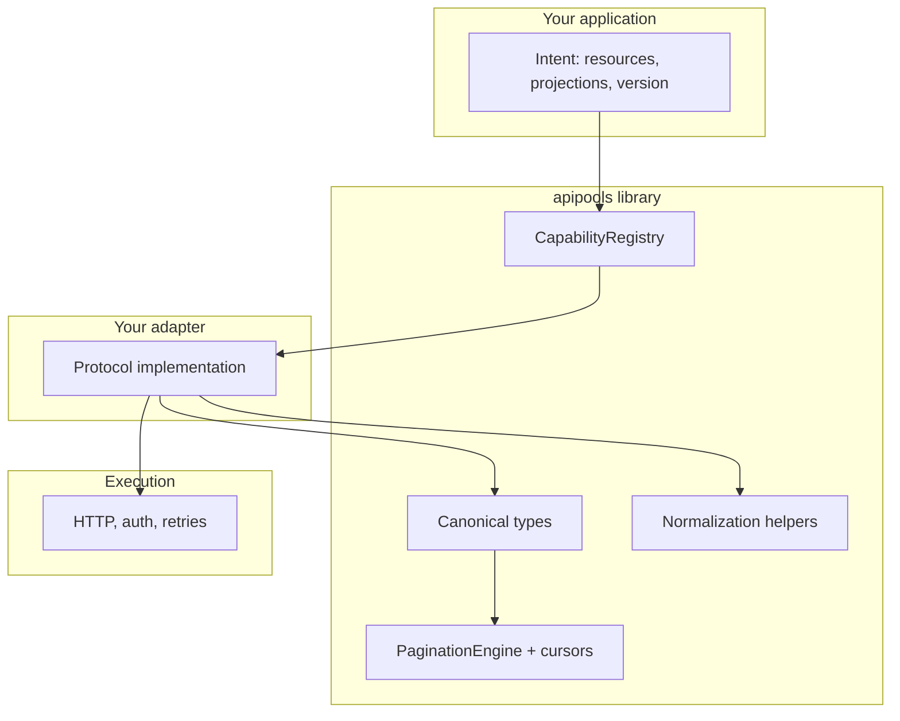

# API Pools

**Contract-first semantic interoperability for heterogeneous APIs.** API Pools gives you shared **canonical meaning**, **typed capability checks**, **version-aware normalization hooks**, and **semantic pagination**—with **explicit gaps** when vendors diverge instead of silent “best effort” drift.

The installable package is **intentionally small**: protocols, primitives, and composition helpers. **Your application** (or tests beside this repo) supplies concrete adapters and HTTP clients.

---

## At a glance

| What you get | What you bring |
|--------------|----------------|
| Canonical types, capability registry, structured errors | Binding classes implementing the domain `Protocol`s |
| Pagination engine + opaque signed cursors | Wire fetchers and pure normalizers |
| Multi-provider registry + deterministic executor (no hidden fallback) | `CoreProvider` implementations |

---

## Architecture



Deeper conceptual material (bounded contexts, constitution clauses, pagination laws) lives in the **Sphinx docs** under `docs/source/`.

---

## Install

```bash
pip install apipools
# Optional Redis-backed cursor store
pip install "apipools[redis]"
```

**From a clone** (tests, compliance CLI, lint):

```bash
pip install -e ".[dev]"
```

---

## Documentation

Build HTML locally:

```bash
pip install -e ".[docs]"
cd docs && python -m sphinx -b html source build/html
```

Open `docs/build/html/index.html`. The **Quickstart** and **Architecture** sections are the best entry points.

---

## Constitution compliance (this repository)

The `apipools-compliance` console script runs the test suite and maps outcomes to declared clauses (`compliance_cli` package—it is **not** part of the public library surface).

```bash
apipools-compliance --format human
# or
python -m compliance_cli
```

---

## Project principles

- **Honest interoperability** — unsupported semantics and partial mappings are visible (`gap` strings, typed errors), not implied.
- **Normalization is pure** — deterministic given wire input, version pin, and capability slice (no I/O inside the mapper proper).
- **Execution is downstream** — transport and credentials implement contracts; they do not redefine canonical meaning.

For full narrative (philosophy, non-goals, versioning rules), see the documentation tree.

---

## Package layout (library)

| Area | Modules |
|------|---------|
| Semantics | `apipools.canonical`, `apipools.capabilities`, `apipools.errors` |
| Contracts | `apipools.protocols` (`Protocol` ports for bindings) |
| Normalization | `apipools.normalization` (schema + capability normalizer) |
| Pagination | `apipools.pagination` (`MemoryCursorStore`, optional `RedisCursorStore`) |
| Multi-binding | `apipools.core`, `apipools.routing` |
| Resilience | `apipools.resilience` |

**Reference implementations** used by this repo’s pytest suite live under `tests/support/` and are **not** shipped as `apipools` subpackages.

---

## License

MIT — see [LICENSE](LICENSE).
